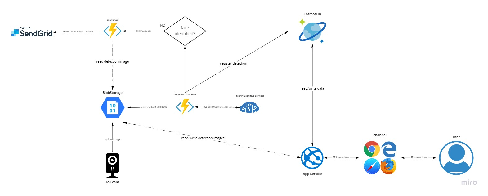

# Access Monitor
Access Monitor è un sistema software il cui obiettivo è fornire un servizio di security e controllo degli
accessi per luoghi chiusi al pubblico (in cui si consente l'accesso solo a del personale autorizato).
Una videocamera IoT rileva volti umani durate la registrazione e li inoltra al sistema di autenticazione
che registra un accesso autorizzato o non autorizzato. Gli amministratori della security possono
avere accesso alla cronologia di tutti gli accessi autorizzati e non.

## Architettura del sistema

